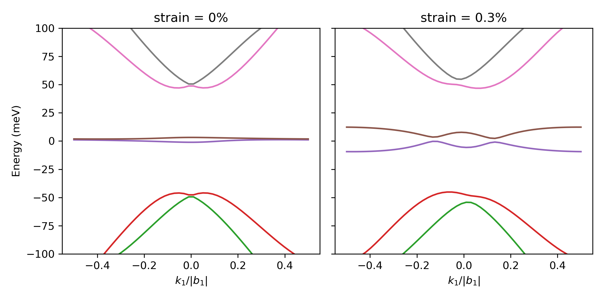
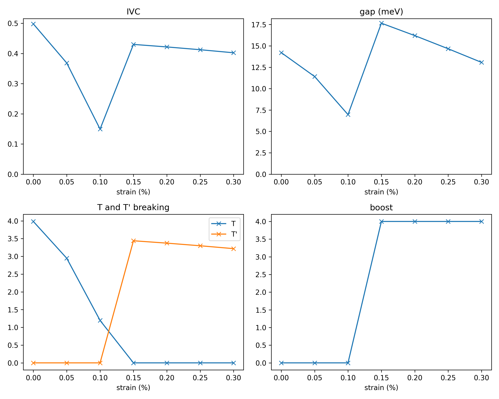

# TBG-HF (Twisted Bilayer Graphene - Hartree-Fock)

TBG-HF is a Python code for self-consistent Hartree-Fock (HF) calculations on the continuum model of twisted bilayer graphene (TBG).  
It includes heterostrain effects and allows for the specific type of translational symmetry breaking that is necessary for finding the incommensurate Kekulé spiral (IKS) state. 

This code release accompanies the reference
* YH Kwan, Z Wang, G Wagner, N Bultinck, SH Simon, SA Parameswaran: Mean-field Modelling of Moiré Materials: A User's Guide with Selected Applications to Twisted Bilayer Graphene: [arxiv:2511.21683](https://arxiv.org/pdf/2511.21683)

When publishing work that uses this code, please cite the reference above. For questions or comments about the code, please contact YH Kwan (yveshkwan@gmail.com), Z Wang (ziwei_wang98@outlook.com), or G Wagner (gwagner@phys.ethz.ch).

This code is a simplified version of that used in the following references

* YH Kwan, G Wagner, T Soejima, MP Zaletel, SH Simon, SA Parameswaran, N Bultinck: Kekulé spiral order at all nonzero integer fillings in twisted bilayer graphene:  [Phys. Rev. X 11, 041063 (2021)](https://journals.aps.org/prx/abstract/10.1103/PhysRevX.11.041063)
* G Wagner, YH Kwan, N Bultinck, SH Simon, SA Parameswaran: Global Phase Diagram of the Normal State of Twisted Bilayer Graphene:  [Phys. Rev. Lett. 128, 156401 (2022)](https://journals.aps.org/prl/abstract/10.1103/PhysRevLett.128.156401)

The current code release does not include features such as general translation symmetry-breaking, spin non-collinearity, more general interaction schemes, time-dependent Hartree-Fock, and other post-Hartree-Fock analysis routines that were used in the above references and other publications.


---

# Table of Contents

1. [Requirements](#requirements)
2. [How to run this code](#how-to-run-this-code)
3. [Flowchart of the code](#flowchart-of-the-code)
4. [Example 1: BM Model Bandstructure](#example-1-bm-model-bandstructure)
5. [Example 2: KIVC-IKS phase transition](#example-2-kivc-iks-phase-transition)
6. [Input Parameters](#input-parameters)
7. [Single-Particle Routines (`singleParticle.py`)](#singleparticlepy)
8. [Projector Generation (`projectors.py`)](#projectorspy)
9. [Projector Measurements (`measure.py`)](#measurepy)
10. [Hartree-Fock Routines (`routines.py`)](#routinespy)
11. [Main HF Driver (`mainProgram.py`)](#mainprogrampy)


---

# Requirements

This code is designed to be run on `python3`. Additionally, the following libraries should be installed: `numpy`, `time`, `json`, `os`, `shutil`. Besides numpy, these packages are all part of a standard Python installation. To install numpy, pip can be used:
```bash
pip install numpy
```
RAM requirements for this code are benign (for reasonable system sizes) and it should run on any current laptop. 


# How to run this code

The Python files `test_singleParticle.py` and `test_mainProgram.py` provide an example execution of a Hartree-Fock calculation from start to finish. The calculation is a two-step process. 

In the first step, the desired Bistritzer-MacDonald (BM) continuum model parameters are specified in the JSON file `int_input.json`, and `test_singleParticle.py` is run:
```bash
python3 test_singleParticle.py
```
This Python file creates the (strained) BM Hamiltonian for the choice of single-particle parameters that are specified in `int_input.json`. See [Input Parameters](#input-parameters) for details of the inputs.
This Hamiltonian is diagonalized on a discrete momentum k-mesh, yielding the single-particle eigenvectors and eigenvalues of the BM Hamiltonian. In addition, the code calculates the Fourier transform of the interaction potential. Various output files that are necessary for the subsequent Hartree-Fock iterations are saved in the directory `./bandstructure/` and can be re-used for different Hartree-Fock runs. These include Python arrays that are stored in the [numpy .npy format](https://numpy.org/devdocs/reference/generated/numpy.lib.format.html) for future use: `coeff.npy`, `sp_energy.npy`, `U_C2T.npy`, `intFT.npy`. The JSON file `int_pd.json` is also created, which is required for the Hartree-Fock code. 

In the second step, the desired HF parameters are specified in `HF_input.json` (see [Input Parameters](#input-parameters) for details of the inputs), and `test_mainProgram.py` is run:
```bash
python3 test_mainProgram.py
```
The code performs the Hartree-Fock self-consistency procedure for the choice of HF parameters in `HF_input.json`. The results are saved in the directory `./b0_0_seed0/`, where the directory name denotes the fact that the HF calculation is performed with a vanishing intervalley boost and seed number 0.

# Flowchart of the code

Below, we illustrate the entire code. The rounded green boxes contain the names of the python functions that are used, while the blue boxes contain the names of the python arrays which are the outputs (inputs) of the python function above (below). The functions are explained in the later sections of this documentation. The loop forming the centrepiece of the self-consistent Hartree-Fock calculation is indicated by the black curved arrow. The black dashed line shows the division of the tasks between the two files `singleParticle.py` and `mainProgram.py`.


# Example 1: BM Model Bandstructure

As a first example we will plot the bandstructure of TBG with and without strain. 

```bash
python3 example1.py
```

Note that the `matplotlib` library is necessary for this calculation.

For the default set of parameters, the output should look as follows



In the presence of strain, the Dirac points are unpinned from the $K_M$ and $K'_M$ points and migrate towards the centre of the mBZ, hence modifying the bandstructure.

# Example 2: KIVC-IKS phase transition

In the second example, we will study the transition between the low-strain KIVC phase and the high-strain IKS phase at $\nu=+2$ in TBG. The purpose of this code is to plot properties of the HF ground state as a function of strain, allowing the critical strain at which the transition from KIVC to IKS occurs to be determined. The example code aims to generate data similar to that in Fig. 3a of [Phys. Rev. X 11, 041063 (2021)](https://journals.aps.org/prx/abstract/10.1103/PhysRevX.11.041063).

First, we need to generate the single-particle files for different values of strain. In this case we chose to take strain values between 0.0% and 0.3% in steps of 0.05% and pick a system size of $12\times12$ moiré unit cells. To run this:
```bash
python3 example2_singleParticle.py
```
The runtime is less than one minute on a 2021 MacBook Pro (Apple M1 Pro chip). 

Now that the single-particle files are saved, we can run the HF iterations. We allow the valley boost to take two different values `boost1=0` for the KIVC and `boost1=4` for the IKS, with `boost2=0` in both cases. In principle one should consider all possible values of the boost and pick the lowest energy solution. In the simplified calculation here, we will use the fact that for these parameter values, `boost1=4` and `boost2=0` is close to the ideal value for the IKS (see [Phys. Rev. X 11, 041063 (2021)](https://journals.aps.org/prx/abstract/10.1103/PhysRevX.11.041063)). We run 10 seeds for each parameter value. For the KIVC state `"random"` seeds are preferred, while for the IKS state `"BM"` seeds are used too. For detailed phase diagrams, it may be preferable to run this step in parallel on many cores. However, in this example we will simply run everything sequentially. To run the HF iterations:

```bash
python3 example2_mainProgram.py
```
Capping the maximum number of HF iterations at 800 per run (`"HF_itermax":800` in `HF_input.json` input file), we find that the runtime is around 20 minutes on a 2021 MacBook Pro (Apple M1 Pro chip). 

Finally, we can plot the results using

```bash
python3 example2_plot.py
```
Note that the `matplotlib` library is necessary for this last step. The figure generated should look like the one below:



The results show a transition from the KIVC (which respects T' symmetry and has IVC at vanishing intervalley boost) and the IKS (which respects T symmetry and has IVC at a finite intervalley boost). The transition point is between 0.1% and 0.15% strain for this choice of parameters and interaction scheme. By default we are using the "central average" scheme, which is different from that used for Fig. 3a of [Phys. Rev. X 11, 041063 (2021)](https://journals.aps.org/prx/abstract/10.1103/PhysRevX.11.041063).

# Input Parameters

## int_input.json

In the table below, we list all the parameters of the input dictionary that need to be specified inside `int_input.json`. We also list the "default" value, which is the value that parameter is set to in `int_input.json` in the repository. The user can modify this file to specify the desired parameters. The system size is chosen so the code runs reasonably fast, but often larger system sizes are required to mitigate finite-size effects. 

| Parameter          | Default Value | Notes |
|-------------------|---------------|-------|
| N1                 | 8             | System size along 1 |
| N2                 | 8             | System size along 2 |
| Ng1                | 4             | Momentum cutoff of plane-wave explansion along b1 |
| Ng2                | 4             | Momentum cutoff of plane-wave explansion along b2 |
| NG1                | 5             | Momentum cutoff of interaction along b1 |
| NG2                | 5             | Momentum cutoff of interaction along b2 |
| n_active           | 1             | Number of active bands per spin and valley divided by 2 (n_active=1 corresponds to all central bands) |
| dsc                | 2.5e-08       | Effective gate distance (m) |
| gates              | "dual"        | Gate configuration (options "dual" or "single") |
| include_q=0        | true          | Include q = 0 in the interaction potential? |
| theta              | 1.08          | Twist angle (degrees) |
| wAA                | 0.07          | Intra-sublattice tunneling (eV) |
| wAB                | 0.11          | Inter-sublattice tunneling (eV) |
| varphi             | 0             | Strain angle (degrees) |
| strain             | 0.003         | Strain magnitude (0.003 corresponds to 0.3%) |

We remind the reader that `Ng1`, `Ng2`, `NG1`, and `NG2` should be chosen to be large enough such that the results are sufficiently insensitive to these cutoffs.

## HF_input.json

In the table below, we list all the parameters of the input dictionary that need to be specified inside `HF_input.json`. We also list the "default" value, which is the value that parameter is set to in `HF_input.json` in the repository. The user can modify this file to specify the desired parameters. 

| Parameter         | Default Value | Notes |
|-------------------|---------------|-------|
| epsr              | 10            | Relative dielectric constant |
| ref_choice        | "average central" | Reference projector for the interaction scheme (see section [Projector types](#projectorspy) for options) |
| in_choice         | "random"       | Initial projector (see section [Projector types](#projectorspy) for options) |
| filling           | 2             | Number of electrons per moiré cell relative to neutrality |
| exchange          | true          | Include exchange interactions? |
| boost1            | 0             | Intervalley momentum boost direction 1 (from 0 to N1-1) |
| boost2            | 0             | Intervalley momentum boost direction 2 (from 0 to N2-1) |
| seed              | 0             | Random seed |
| HF_itermax        | 800          | Maximum number of HF iterations. If sufficient computational ressources are available, a larger value (2000-5000) should be chosen. Users should check that a HF run has converged and discard runs where the iterations terminated due to reaching HF_itermax. |
| HF_itermin        | 20            | Minimum HF iterations before convergence checks start |
| HF_tolerance      | 1e-08         | HF convergence tolerance |
| measure_period    | 100           | Iteration interval for measurement |
| HF_type           | "ODA"         | HF mixing type ("ODA" or "iteration") |
---


# singleParticle.py
This python script handles the single-particle calculations necessary for the later Hartree-Fock. It computes the BM Hamiltonian (including strain) and diagonalizes it to obtain the eigenvalues and eigenvectors, which are saved for later use. It also computes the Fourier transform of the interaction potential, which is saved for later use as well.  

## gen_RLVs(pd)

**Inputs**	
| Name | Shape | Type | Description |
|------|-------|------|-------------|
| `pd` | — | dict | Parameter dictionary with system sizes, twist angle, etc. (see `int_input.json` file) |

**Outputs**

| Name | Shape | Type | Description |
|------|-------|------|-------------|
| `M1` | `(2,2)` | float | transformation matrix M for layer 1 |
| `M2` | `(2,2)` | float | transformation matrix M for layer 2 |
| `b1` | `(2)` | float | first moiré reciprocal lattice vector  |
| `b2` | `(2)` | float | second moiré reciprocal lattice vector |
| `Etens1` | `(2,2)` | float | strain matrix S for layer 1 |
| `Etens2` | `(2,2)` | float | strain matrix S for layer 2 |
	

- Generates real-space twist/strain transformations M for both layers and from those computes the moiré reciprocal lattice vectors.
- The relevant equations for uniaxial heterostrain are
```math
\begin{gathered}
\mathbf{r}_l = M_l^{T}\mathbf{r}, \quad 
\mathbf{g}_l = M_l^{-1}\mathbf{g}, \\[4pt]
M_1=R(\theta/2) +S(\epsilon/2,\varphi),\\[4pt]
M_2=R(-\theta/2) +S(-\epsilon/2,\varphi), \\[6pt]
S(\epsilon,\varphi)
= R^{-1}(\varphi)
\begin{pmatrix}
-\epsilon & 0\\
0 & \nu_\text{P}\epsilon
\end{pmatrix} R(\varphi), \quad R(\alpha)=\begin{pmatrix}
\cos\alpha & -\sin\alpha\\
\sin\alpha & \cos\alpha
\end{pmatrix} \\
\mathbf{b}_1=(M^{-1}_1-M^{-1}_2)(\mathbf{b}_{G2}-\mathbf{b}_{G1}),\quad \mathbf{b}_2=(M^{-1}_1-M^{-1}_2)\mathbf{b}_{G1}
\end{gathered}
```

 

## gen_moire_hamiltonian(pd, ik)

**Inputs**	
| Name | Shape | Type | Description |
|------|-------|------|-------------|
| `pd` | — | dict | Parameter dictionary with system sizes, twist angle, etc. (see `int_input.json` file) |
| `ik` | (2) | int | Momentum index |

**Outputs**

| Name | Shape | Index Meaning | Type | Description |
|------|-------|------|------|-------------|
| `H_BM` | `(4*Ng1*Ng2,4*Ng1*Ng2)` |`basis, basis` |complex |Bloch Hamiltonian|

- Build BM Hamiltonian at momentum `(ik1, ik2)` in valley K.
```math
\begin{gather}
	\bra{\mathbf{p},1}H_\text{BM}\ket{\mathbf{p}',1} = \hbar v_F \mathbf{\sigma}^*_{\theta/2}\cdot(\mathbf{p}-\mathbf{K}^1)\,\delta_{\mathbf{p},\mathbf{p}'}\\
	\bra{\mathbf{p},2}H_\text{BM}\ket{\mathbf{p}',2} = \hbar v_F \mathbf{\sigma}^*_{-\theta/2}\cdot(\mathbf{p}-\mathbf{K}^2)\,\delta_{\mathbf{p},\mathbf{p}'}\\
	\bra{\mathbf{p},1}H_\text{BM}\ket{\mathbf{p}',2} = 
	T_1\delta_{\mathbf{p}-\mathbf{p}',\mathbf{0}} + T_2\delta_{\mathbf{p}-\mathbf{p}',\mathbf{b}_{1}+\mathbf{b}_2} + T_3\delta_{\mathbf{p}-\mathbf{p}',\mathbf{b}_{2}}\\
	\mathbf{\sigma}^*_{\theta/2}=e^{-(i\theta/4)\sigma_z}(\sigma_x,\sigma_y^*)e^{(i\theta/4)\sigma_z}\\
	T_1 = \begin{pmatrix}w_\textrm{AA}&w_\textrm{AB}\\w_\textrm{AB}&w_\textrm{AA}\end{pmatrix}\\
	T_2 = \begin{pmatrix}w_\textrm{AA}&w_\textrm{AB}e^{i\phi}\\w_\textrm{AB}e^{-i\phi}&w_\textrm{AA}\end{pmatrix}\\
	T_3 = \begin{pmatrix}w_\textrm{AA}&w_\textrm{AB}e^{-i\phi}\\w_\textrm{AB}e^{i\phi}&w_\textrm{AA}\end{pmatrix}\\
	\phi=\frac{2\pi}{3}.
\end{gather}
```

  

## gen_coeff(pd)

**Inputs**	
| Name | Shape | Type | Description |
|------|-------|------|-------------|
| `pd` | — | dict | Parameter dictionary with system sizes, twist angle, etc. (see `int_input.json` file) |


**Outputs**

| Name | Shape | Index Meaning | Type | Description |
|------|-------|------|------|-------------|
| `coeff` | `(N1,N2,2*Ng1,2*Ng2,2,2*n_active,4)` |`ik1,ik2,g1,g2,tau,band,species` |complex |Bloch eigenstates of BM Hamiltonian|
| `sp_energy` | `(N1,N2,2,2*n_active)` |`ik1,ik2,tau,band` |float |Bloch eigenvalues of BM Hamiltonian|

- Diagonalize BM Hamiltonian in valley K, return Bloch coefficients and single-particle energies. The Bloch coefficients and single-particle energies in valley K' are obtained using time-reversal symmetry.

  


## gen_interaction(pd)

**Inputs**	
| Name | Shape | Type | Description |
|------|-------|------|-------------|
| `pd` | — | dict | Parameter dictionary with system sizes, twist angle, etc. (see `int_input.json` file) |


**Outputs**

| Name | Shape | Index Meaning | Type | Description |
|------|-------|------|------|-------------|
| `intFT` | `(N1,N2,2*NG1,2*NG2)` |`ik1,ik2,G1,G2` |float|Fourier transform of interaction potential|

- Fourier transform of Coulomb interaction with gate screening (with area factor in normalization): $\frac{1}{A}V(k+G)$  
- dual gate: $V(q)=\frac{e^2}{2\epsilon_0\epsilon_r q}\tanh{qd_{\text{sc}}}$ 
- single gate: $V(q)=\frac{e^2\left(1-e^{-2qd_{\text{sc}}}\right)}{2\epsilon_0\epsilon_r q}$

  

## gen_form_factors(pd, c, cp)

**Inputs**	
| Name | Shape | Index Meaning | Type | Description |
|------|-------|------|-------------|-------------|
| `pd` | — | — | dict | Parameter dictionary with system sizes, twist angle, etc. (see `int_input.json` file) |
| `c` | `(N1,N2,2*Ng1,2*Ng2,4)`|`ik1,ik2,g1+Ng1,g2+Ng2,species` | complex | Bloch eigenstates in band1 and valley1 |
| `cp` | `(N1,N2,2*Ng1,2*Ng2,4)`|`ik1,ik2,g1+Ng1,g2+Ng2,species` | complex | Bloch eigenstates in band2 and valley1 |

**Outputs**

| Name | Shape | Index Meaning | Type | Description |
|------|-------|------|------|-------------|
| `form` | `(N1,N2,N1,N2,2*NG1,2*NG2)` |`ik1,ik2,iq1,iq2,G1,G2` |complex| form factors between band1 and band2 and in valley1|

- Compute intravalley form factors:
```math
\lambda_{\tau,ab}(\mathbf{k},\mathbf{q})
= \langle u_{\tau,a}(\mathbf{k})| u_{\tau,b}(\mathbf{k}+\mathbf{q}) \rangle
= \sum_{\mathbf{G},l,\sigma}
u^*_{\tau a;l\sigma}(\mathbf{k},\mathbf{G})
u_{\tau b;l\sigma}(\mathbf{k}+\mathbf{q},\mathbf{G})
```

  


## Symmetry Operators

| Function        | Symmetry | Notes |
|-----------------|----------|-------|
| `C2T_symmetry`  | C₂T      | Flips sublattice |
| `C2_symmetry`   | C₂       | Flips valley and sublattice |
| `C3_symmetry`   | C₃       |  |
| `symmetry_check`| - | Prints maximum deviation |


---

# projectors.py
This python script is used to generate Hartree-Fock projectors (density matrices). These projectors are used for the reference state (in the context of the interaction scheme) and for the initial input state to start the Hartree-Fock iterations. Different choices of reference state and initial state are possible, which we list below. Throughout the code, we use the index ordering convention $P_{\alpha\beta}(\mathbf{k},s) = \braket{c^\dagger_{\alpha s}(\mathbf{k})c_{\beta s}(\mathbf{k})}$, where $\alpha$ and $\beta$ are combined valley-band indices.


## gen_projector(pd, choice, sp_energy)

**Inputs**	
| Name | Shape | Index Meaning | Type | Description |
|------|-------|------|-------------|-------------|
| `pd` | — | — | dict | Parameter dictionary with system sizes, twist angle, etc. (see `int_input.json` file) |
| `choice` | — | — | string | e.g. "BM", "random", etc. (see table below) |
| `sp_energy` | `(N1,N2,2,2*n_active)` |`ik1,ik2,tau,band` |float |Bloch eigenvalues of BM Hamiltonian|

**Outputs**

| Name | Shape | Index Meaning | Type | Description |
|------|-------|------|------|-------------|
| `P` | `(N1,N2,2,4*n_active,4*n_active)` |`ik1,ik2,s,band*valley,band*valley` |complex| one-body density matrix (HF projector)|

- Creates a projector based on the initialization scheme.

**Projector Types:**

| Choice             | Meaning |Use|
|--------------------|--------|----|
| "empty"            | No states filled | reference projector |
| "full"             | All states filled |reference projector |
| "CN"               | Occupy valence bands |reference projector |
| "average"          | Uniform 1/2 filling |reference projector |
| "average central"  | Central bands half-filled, others filled/empty |reference projector |
| "random"           | Random electron distribution |initialization|
| "BM"               | Occupy states up to filling according to BM spectrum |initialization|


---

# measure.py

This python code serves to measure the properties of a Hartree-Fock density matrix. 

## measure_projector(pd, P, E,U_C2T,HFeigs,fill_index)

**Inputs**	
| Name | Shape | Index Meaning | Type | Description |
|------|-------|------|-------------|-------------|
| `pd` | — | — | dict | Parameter dictionary with system sizes, twist angle, etc. (see `int_input.json` file) |
| `P` | `(N1,N2,2,4*n_active,4*n_active)` |`ik1,ik2,s,band*valley,band*valley` |complex| one-body density matrix (HF projector)|
| `E` | `(4)` | `E_tot, E_kin, E_D, E_E` |float| HF energies|
| `U_C2T` | `(N1,N2,2,4*n_active,4*n_active)` |`ik1,ik2,valley,band` |complex| Action of C2T symmetry|
| `HFeigs` | `(N1*N2*2*4*n_active)` |`ik1*ik2*s*band*valley` |float| HF eigenvalues|
| `fill_index` | `(n_elec)` |`filled` |int| indices of filled HF orbitals|

**Outputs**

| Name | Shape |  Type | Description |
|------|-------|------|------|
| `out` | - |`dict` | Measurement outcomes (see table below)|

- Measures physical observables from a projector.

**Measured quantities:**

| Quantity             | Meaning |
|--------------------|--------|
| "energy"            | Hartree-Fock energy |
| "gap"             | Energy difference between lowest unoccupied HF state and highest occupied HF state |
| "difference"               | Difference between the projector in the last HF iteration and the previous one, if this is large, it indicates this HF run has not converged |
| "valley polarization"          | valley polarization in units of N1*N2 electrons |
| "IVC"  |intervalley coherence |
| "spin polarization"           | spin polarization in units of N1*N2 electrons |
| "C2T break"               | Amount of C2T breaking (for an IVC state, this value depends on the IVC angle) |
| "T break"               | Amount of time-reversal symmetry breaking  |
| "Tp break"               | Amount of T' breaking (T' being the modified time-reversal symmetry satisfied by the KIVC state)  |
| "Max. Occ. Spin Up"     | Maximum number of occupied orbitals per momentum in the spin up sector  |
| "Min. Occ. Spin Up"     | Minimum number of occupied orbitals per momentum in the spin up sector  |
| "Max. Occ. Spin Down"     | Maximum number of occupied orbitals per momentum in the spin down sector  |
| "Min. Occ. Spin Down"     | Minimum number of occupied orbitals per momentum in the spin down sector  |


---

# routines.py

This python  script contains several functions that are used in the Hartree-Fock iterations, in particular the code to generate the Hartree-Fock Hamiltonian and to diagonalize it. 

## gen_H_SP(pd, sp_energy)

**Inputs**	
| Name | Shape | Index Meaning | Type | Description |
|------|-------|------|-------------|-------------|
| `pd` | — | — | dict | Parameter dictionary with system sizes, twist angle, etc. (see `int_input.json` file) |
| `sp_energy` | `(N1,N2,2,4*n_active)` |`ik1,ik2,tau,a` |float| single particle energies|


**Outputs**
| Name | Shape | Index Meaning | Type | Description |
|------|-------|------|------|-------------|
| `H_SP` | `(N1,N2,2,4*n_active,4*n_active)` |`ik1,ik2,s,tau*a,tau*a` |float| single particle Hamiltonian|

- Generates the one-body HF Hamiltonian.


## gen_M_tVE(pd, form, intFT)

**Inputs**	
| Name | Shape | Index Meaning | Type | Description |
|------|-------|------|-------------|-------------|
| `pd` | — | — | dict | Parameter dictionary with system sizes, twist angle, etc. (see `int_input.json` file) |
| `form` | `(N1,N2,N1,N2,2*NG1,2*NG2,2,2*n_active,2*n_active)` |`ik1,ik2,iq1,iq2,G1,G2,tau,a,b` |complex| form factors|
| `intFT` | `(N1,N2,2*NG1,2*NG2)` |`ik1,ik2,G1,G2` |float|Fourier transform of interaction potential|


**Outputs**
| Name | Shape | Index Meaning | Type | Description |
|------|-------|------|------|-------------|
| `form` | `(N1,N2,N1,N2,2*NG1,2*NG2,2,2*n_active,2*n_active)` |`ik1,ik2,iq1,iq2,G1,G2,tau,a,b` |complex| form factors|
| `M` | `(N1,N2,N1,N2,2*NG1,2*NG2,2,2*nact,2*nact)` |`ik1,ik2,iq1,iq2,G1,G2,tau,a,b` |complex|contraction of form factors with interaction potential|
| `tVE` | `(N1*N2*4*nact**2,N1*N2*4*nact**2,4)` |`k1*k2*a*d,q1*q2*b*c,tau*taup` |complex|contraction of M with another form factor|

- We compute two arrays, `M` and `tVE` from contractions of `form` and `intFT`. It is more computationally efficient to perform these contractions outside the Hartree-Fock iterations loop, since this way the contractions only need to be performed once.
```math
M_{\tau,ab}(\mathbf{k},\mathbf{q},\mathbf{G})=V(\mathbf{q},\mathbf{G})\lambda_{\tau,ab}(\mathbf{k},\mathbf{q},\mathbf{G})^*
```

```math
VE_{\tau\tau',adbc}(\mathbf{k},\mathbf{q})=\sum_{\mathbf{G}}\lambda_{\tau,ab}(\mathbf{k},\mathbf{q},\mathbf{G})M_{\tau',dc}(\mathbf{k},\mathbf{q},\mathbf{G})
```

```math
tVE_{\tau\tau',adbc}(\mathbf{k},\mathbf{q})=VE_{\tau\tau',adbc}(\mathbf{k},\mathbf{q}-\mathbf{k})
```


## calc_fock_matrix(pd, P, form, M, tVE, timeit=False)

**Inputs**	
| Name | Shape | Index Meaning | Type | Description |
|------|-------|------|-------------|-------------|
| `pd` | — | — | dict | Parameter dictionary with system sizes, twist angle, etc. (see `int_input.json` file) |
| `P` | `(N1,N2,2,4*n_active,4*n_active)` |`ik1,ik2,s,band*valley,band*valley` |complex| one-body density matrix (HF projector)|
| `form` | `(N1,N2,N1,N2,2*NG1,2*NG2,2,2*n_active,2*n_active)` |`ik1,ik2,iq1,iq2,G1,G2,tau,a,b` |complex| form factors|
| `M` | `(N1,N2,N1,N2,2*NG1,2*NG2,2,2*nact,2*nact)` |`ik1,ik2,iq1,iq2,G1,G2,tau,a,b` |complex|contraction of form factors with interaction potential|
| `tVE` | `(N1*N2*4*nact**2,N1*N2*4*nact**2,4)` |`k1*k2*a*d,q1*q2*b*c,tau*taup` |complex|contraction of M with another form factor|


**Outputs**	
| Name | Shape | Index Meaning | Type | Description |
|------|-------|------|-------------|-------------|
| `HFham_D` | `(N1,N2,N1,N2,2*NG,2*NG,2,2*nact,2*nact)` | `ik1,ik2,iq1,iq2,G1,G2,tau,a,b` | complex | Hartree (direct) Hamiltonian |
| `HFham_E` | `(N1,N2,N1,N2,2*NG,2*NG,2,2*nact,2*nact)` | `ik1,ik2,iq1,iq2,G1,G2,tau,a,b` |complex| Fock (exchange) Hamiltonian|

- Constructs HF Hartree and Fock matrices which we call `HFham_D` and `HFham_E`  respectively from a projector `P`. D stands for direct term and E stands for exchange term. 
```math
{H}^\text{D}_{\tau a, \tau' b}(\mathbf{k}, s) = 
\delta_{\tau \tau'}\sum_{\mathbf{G}}\lambda_{\tau,ab}(\mathbf{k},0,\mathbf{G})\sum_{\mathbf{k}'\in\text{ mBZ}}\sum_{s'\tau''cd}M_{\tau'',dc}(\mathbf{k}',0,\mathbf{G}){P}_{\tau''d,\tau'' c}(\mathbf{k}',s') 
```
```math
{H}^{\text{E}}_{\tau a , \tau' b}(\mathbf{k},s)
=-\sum_{cd}\sum_{\mathbf{q}\in\text{all}}tVE_{\tau\tau',adcb}(\mathbf{k},\mathbf{q}){P}_{\tau d, \tau' c}(\mathbf{q},s)
```


## aufbau(pd, HFham, timeit=False)

**Inputs**	
| Name | Shape | Index Meaning | Type | Description |
|------|-------|------|-------------|-------------|
| `pd` | — | — | dict | Parameter dictionary with system sizes, twist angle, etc. (see `int_input.json` file) |
| `HFham` | `(N1,N2,N1,N2,2*NG,2*NG,2,2*nact,2*nact)` | `ik1,ik2,iq1,iq2,G1,G2,tau,a,b` | complex | Hartree-Fock Hamiltonian |


**Outputs**	
| Name | Shape | Index Meaning | Type | Description |
|------|-------|------|-------------|-------------|
| `P` | `(N1,N2,2,4*n_active,4*n_active)` |`ik1,ik2,s,band*valley,band*valley` |complex| one-body density matrix (HF projector)|
| `HFeigs` | `(N1*N2*2*4*n_active)` |`ik1*ik2*s*band*valley` |float| HF eigenvalues|
| `fill_index` | `(n_elec)` |`filled` |int| indices of filled HF orbitals|
| `evecs` | `(N1*N2*2,4*n_active,4*n_active)` |`ik1*ik2*s,band*valley,index` |complex| HF eigenvectors|


- Constructs HF projector using Aufbau principle.


## calc_E(pd, P, P_ref, sp_energy, HFham_D, HFham_E)

**Inputs**	
| Name | Shape | Index Meaning | Type | Description |
|------|-------|------|-------------|-------------|
| `pd` | — | — | dict | Parameter dictionary with system sizes, twist angle, etc. (see `int_input.json` file) |
| `P` | `(N1,N2,2,4*n_active,4*n_active)` |`ik1,ik2,s,band*valley,band*valley` |complex| one-body density matrix (HF projector)|
| `Pref` | `(N1,N2,2,4*n_active,4*n_active)` |`ik1,ik2,s,band*valley,band*valley` |complex| reference projector|
| `sp_energy` | `(N1,N2,2,4*n_active)` |`ik1,ik2,tau,a` |float| single particle energies|
| `HFham_D` | `(N1,N2,N1,N2,2*NG,2*NG,2,2*nact,2*nact)` | `ik1,ik2,iq1,iq2,G1,G2,tau,a,b` | complex | Hartree (direct) Hamiltonian |
| `HFham_E` | `(N1,N2,N1,N2,2*NG,2*NG,2,2*nact,2*nact)` | `ik1,ik2,iq1,iq2,G1,G2,tau,a,b` |complex| Fock (exchange) Hamiltonian|


**Outputs**	
| Name | Shape | Index Meaning | Type | Description |
|------|-------|------|-------------|-------------|
| `E` | `(4)` | `E_tot, E_kin, E_D, E_E` |float| HF energies|

- Calculates total energy and components.

```math
\begin{align}
    E_{\mathrm{tot}} &= E_{\mathrm{kin}} + E_{D} + E_{E},\\[4pt]
    E_{\mathrm{kin}}
    &= \sum_{\tau as}\sum_{\mathbf{k}}
    \varepsilon_{\tau a}(\mathbf{k})P_{\tau a,\tau a}(\mathbf{k},s),
    \\[4pt]
    E_{D}
    &= \tfrac{1}{2}
    \sum_{\tau\tau'abs}\sum_{\mathbf{k}}{H}^\text{D}_{\tau a, \tau' b}(\mathbf{k}, s)(P_{\tau a,\tau' b}(\mathbf{k},s) - P^{\mathrm{ref}}_{\tau a,\tau' b}(\mathbf{k},s)),
    \\[4pt]
    E_{E}
    &= \tfrac{1}{2}
    \sum_{\tau\tau'abs}\sum_{\mathbf{k}}{H}^\text{E}_{\tau a, \tau' b}(\mathbf{k}, s)(P_{\tau a,\tau' b}(\mathbf{k},s) - P^{\mathrm{ref}}_{\tau a,\tau' b}(\mathbf{k},s)).
\end{align}
```


---

# mainProgram.py

This python script is the wrapper that performs the Hartree-Fock iterations. To do so, it calls functions defined in the previously explained files.

## mainP(pd)

**Inputs**	
| Name | Shape | Index Meaning | Type | Description |
|------|-------|------|-------------|-------------|
| `pd` | — | — | dict | Parameter dictionary with system sizes, twist angle, etc. (see `int_input.json` file) |

**Outputs**	
| Name | Shape | Index Meaning | Type | Description |
|------|-------|------|-------------|-------------|
| `E` | `(1)` | - |float| total HF energy|
| `out` | - |-|`dict` | Measurement outcomes (see table in measurements subsection)|
| `P_new` | `(N1,N2,2,4*n_active,4*n_active)` |`ik1,ik2,s,band*valley,band*valley` |complex| final HF projector|
| `HFeigs` | `(N1*N2*2*4*n_active)` |`ik1*ik2*s*band*valley` |float| HF eigenvalues|
| `fill_index` | `(n_elec)` |`filled` |int| indices of filled HF orbitals|
| `evecs` | `(N1*N2*2,4*n_active,4*n_active)` |`ik1*ik2*s,band*valley,index` |complex| HF eigenvectors|

- Full HF calculation routine.
- Steps:
  1. Load `coeff.npy`, `sp_energy.npy`, `U_C2T.npy`, `intFT.npy`
  2. Generate form factors
  3. Generate one-body Hamiltonian `H_SP`
  4. Generate interaction tensors `M` and `tVE`
  5. Generate input and reference projectors
  6. Measure initial projector properties
  7. Iterative HF loop (standard or ODA)
  8. Measure final projector properties


## Convergence criterion

We compute the norm of the difference between the Hartree-Fock projector in the current iteration and the one in the previous iteration. If this difference reaches below a certain tolerance, we exit the self-consistency loop. The iterations will also terminate if the maximum number of iterations have been completed without convergence being reached. It is often desirable to discard such unconverged Hartree-Fock runs.


---

